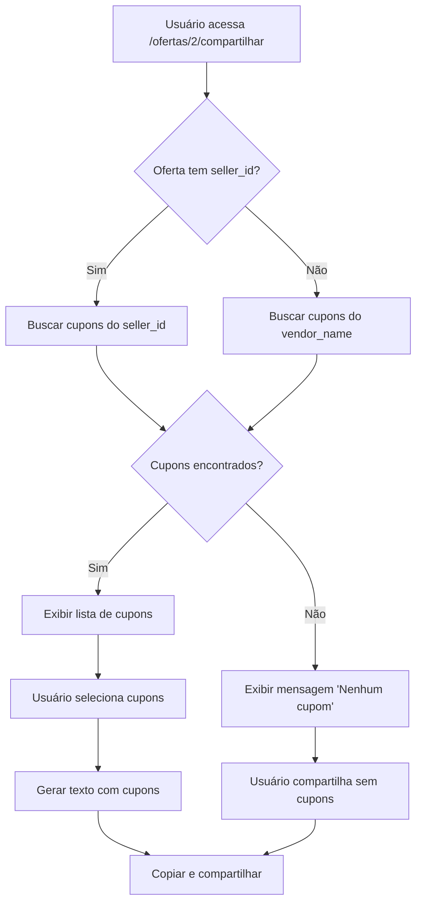

# 🎫 Filtro de Cupons por Vendedor

## 📋 Visão Geral

Na página de compartilhamento de ofertas, agora são exibidos **apenas os cupons do vendedor específico da oferta**, tornando a experiência mais relevante e evitando confusão.

---

## ✨ Funcionalidade

### Comportamento Anterior ❌

- Ao compartilhar uma oferta, **todos os cupons ativos** eram exibidos
- Cupons de outros vendedores apareciam na lista
- Usuário poderia selecionar cupons incompatíveis com a oferta

### Comportamento Atual ✅

- Ao compartilhar uma oferta, **apenas cupons do mesmo vendedor** são exibidos
- Filtro automático por `seller_id`
- Apenas cupons relevantes para aquela oferta específica

---

## 🎯 Exemplo

### Cenário:

**Oferta:**
- Produto: Controle PS5 DualSense
- Vendedor: **Amazon**
- Preço: R$ 399,00

**Cupons no Sistema:**
1. `DESC10` - Amazon - 10% OFF
2. `FRETE` - Amazon - Frete Grátis
3. `MLBR` - Mercado Livre - R$ 20 OFF
4. `SHOPEE10` - Shopee - 10% OFF

### Resultado na Página `/ofertas/2/compartilhar`:

**Cupons Exibidos:**
- ✅ `DESC10` - Amazon - 10% OFF
- ✅ `FRETE` - Amazon - Frete Grátis

**Cupons Ocultos:**
- ❌ `MLBR` - Mercado Livre (vendedor diferente)
- ❌ `SHOPEE10` - Shopee (vendedor diferente)

---

## 🔧 Implementação Técnica

### Backend (`app/routes/web.py`)

**Antes:**
```python
# Get all active coupons
active_coupons = Coupon.query.filter_by(active=True).order_by(Coupon.code).all()
```

**Depois:**
```python
# Get active coupons from the same seller as the offer
active_coupons = Coupon.query.filter_by(
    active=True,
    seller_id=offer.seller_id
).order_by(Coupon.code).all()
```

### Frontend (`app/templates/offer_share.html`)

**Título do Card:**
```html
<h6 class="mb-0">
  <i class="bi bi-ticket-perforated"></i> Cupons do Vendedor (Opcional)
</h6>
```

**Mensagem Informativa:**
```html
<small class="text-muted d-block mb-3">
  <i class="bi bi-info-circle"></i> Cupons disponíveis de <strong>{{ offer.seller.name }}</strong>
</small>
```

**Mensagem quando Não Há Cupons:**
```html
<div class="alert alert-info mb-4" role="alert">
  <i class="bi bi-info-circle"></i>
  <strong>Nenhum cupom disponível</strong> para o vendedor 
  <strong>{{ offer.seller.name }}</strong>.
  <a href="{{ url_for('web.create_coupon') }}" class="alert-link">Criar novo cupom</a>
</div>
```

---

## 🎨 Interface

### Com Cupons Disponíveis:

```
┌─────────────────────────────────────────────────┐
│ 🎟️ Cupons do Vendedor (Opcional)               │
│                              [Todos] [Nenhum]   │
├─────────────────────────────────────────────────┤
│ ℹ️ Cupons disponíveis de Amazon                 │
│                                                  │
│ ☑ DESC10 - Amazon    [-10%]                     │
│ ☑ FRETE - Amazon     [Frete Grátis]             │
│ ☑ NATAL10 - Amazon   [-10% (máx R$ 50,00)]      │
└─────────────────────────────────────────────────┘
```

### Sem Cupons Disponíveis:

```
┌─────────────────────────────────────────────────┐
│ ℹ️ Nenhum cupom disponível                      │
│    para o vendedor Amazon.                      │
│    Criar novo cupom                             │
└─────────────────────────────────────────────────┘
```

---

## 📝 Benefícios

### 1. **Relevância** ✅
- Apenas cupons aplicáveis à oferta são exibidos
- Evita confusão do usuário

### 2. **Usabilidade** ✅
- Lista mais curta e focada
- Mais fácil de selecionar cupons relevantes

### 3. **Consistência** ✅
- Cupons sempre compatíveis com a oferta
- Não há risco de compartilhar cupons inválidos

### 4. **Experiência** ✅
- Mensagem clara sobre o vendedor
- Link para criar cupom quando não há nenhum disponível

---

## 🔍 Casos de Uso

### Caso 1: Oferta com Múltiplos Cupons do Vendedor

**Oferta:** Mercado Livre - Smartphone  
**Cupons Disponíveis:**
- `TECH10` - 10% OFF
- `FRETE` - Frete Grátis
- `NATAL` - R$ 50 OFF

**Resultado:**
- ✅ Todos os 3 cupons são exibidos
- ✅ Usuário pode selecionar múltiplos
- ✅ Sistema calcula o melhor desconto

### Caso 2: Oferta sem Cupons do Vendedor

**Oferta:** Kabum - Mouse Gamer  
**Cupons Disponíveis:** (nenhum para Kabum)

**Resultado:**
- ⚠️ Mensagem "Nenhum cupom disponível para Kabum"
- 🔗 Link para criar novo cupom (admin/editor)
- ✅ Compartilhamento ainda funciona (sem cupons)

### Caso 3: Vendedor com Cupons Inativos

**Oferta:** Amazon - Livro  
**Cupons:**
- `LIVROS10` - Amazon - **INATIVO**
- `PROMO` - Amazon - **ATIVO**

**Resultado:**
- ✅ Apenas `PROMO` é exibido
- ❌ `LIVROS10` fica oculto (inativo)

---

## 🚀 Workflow Completo



---

## ⚙️ Configuração

### Nenhuma configuração adicional necessária!

O filtro é aplicado **automaticamente** com base no `seller_id` da oferta.

---

## 🧪 Testando

### Teste 1: Verificar Filtro

1. Crie 2 vendedores: Amazon e Mercado Livre
2. Crie cupons para cada vendedor:
   - Amazon: `AMZ10`
   - Mercado Livre: `ML20`
3. Crie uma oferta da Amazon
4. Acesse `/ofertas/<id>/compartilhar`
5. **Resultado esperado:** Apenas `AMZ10` é exibido

### Teste 2: Sem Cupons

1. Crie um vendedor: Shopee
2. **Não** crie cupons para Shopee
3. Crie uma oferta da Shopee
4. Acesse `/ofertas/<id>/compartilhar`
5. **Resultado esperado:** Mensagem "Nenhum cupom disponível"

### Teste 3: Cupons Inativos

1. Crie cupom `TEST` para Amazon
2. Desative o cupom
3. Acesse oferta da Amazon para compartilhar
4. **Resultado esperado:** `TEST` não aparece

---

## 🐛 Solução de Problemas

### Problema: Nenhum cupom aparece (mas deveria)

**Causas possíveis:**
1. Cupom está **inativo** (`active = false`)
2. `seller_id` do cupom não corresponde ao `seller_id` da oferta
3. Cupom foi deletado

**Solução:**
```bash
# Verificar cupons do vendedor
sqlite3 instance/app.db "
  SELECT c.id, c.code, c.active, s.name AS seller 
  FROM coupons c
  JOIN sellers s ON c.seller_id = s.id
  WHERE s.id = 1;  # substituir 1 pelo seller_id da oferta
"
```

### Problema: Mensagem "Nenhum cupom disponível" mas há cupons

**Causa:** `seller_id` incompatível

**Solução:**
1. Verificar `seller_id` da oferta
2. Verificar `seller_id` dos cupons
3. Garantir que correspondem

---

## 📚 Documentação Relacionada

- [COUPON_DISCOUNT_FEATURE.md](COUPON_DISCOUNT_FEATURE.md) - Sistema de descontos
- [COUPON_NAMESPACES_COMPLETE.md](COUPON_NAMESPACES_COMPLETE.md) - Namespaces disponíveis
- [SELLER_COLORS_FEATURE.md](SELLER_COLORS_FEATURE.md) - Cores de vendedores

---

## 🎯 Próximas Melhorias (Futuro)

- [ ] Opção para incluir cupons de **todos** os vendedores (toggle)
- [ ] Filtro por tipo de desconto na seleção
- [ ] Preview do desconto antes de selecionar
- [ ] Ordenação por melhor desconto

---

**Data de Implementação:** 04/12/2025  
**Status:** ✅ Implementado e Funcional

