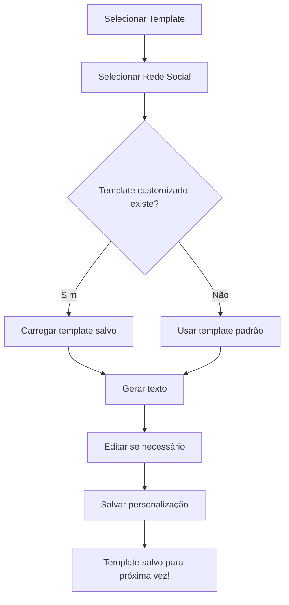

# 💾 Templates Personalizados por Rede Social

## 📋 Visão Geral

O sistema permite salvar **versões personalizadas** de templates para cada rede social. Isso significa que você pode ajustar o conteúdo, formatação e estrutura do template especificamente para WhatsApp, Telegram, Instagram, etc., e o sistema lembrará dessas personalizações para uso futuro.

---

## 🎯 Por Que Usar?

### Problema
Cada rede social tem suas próprias limitações e melhores práticas:
- WhatsApp aceita formatação Markdown (`*negrito*`, `_itálico_`)
- Instagram não aceita formatação, mas funciona bem com emojis
- Telegram suporta links clicáveis `[texto](url)`
- LinkedIn prefere texto profissional e estruturado

### Solução
Com templates personalizados, você pode:
- ✅ Criar uma versão otimizada para cada rede
- ✅ Salvar e reutilizar automaticamente
- ✅ Manter consistência nas postagens
- ✅ Economizar tempo na formatação

---

## 🚀 Como Funciona

### Fluxo de Uso



### Exemplo Prático

#### Cenário: Template "Oferta Especial"

**Template Padrão:**
```
{product_name}
De {old_price} por {price}
Use o cupom: {coupon_code}
```

**Versão WhatsApp** (salva):
```
🔥 *{product_name}* 🔥

De ~{old_price}~ por *{price}*
💰 Economia garantida!

Use o cupom: ```{coupon_code}```

⚡ Corre que é por tempo limitado!
```

**Versão Instagram** (salva):
```
OFERTA ESPECIAL 🔥

{product_name}
De {old_price} por {price}

🎟️ CUPOM: {coupon_code}

💬 Comenta "QUERO" que eu te passo o link!

#oferta #desconto #economia
```

**Versão LinkedIn** (salva):
```
Oportunidade Profissional

{product_name}
Valor promocional: {price}
(Valor anterior: {old_price})

Para mais informações, entre em contato.

Código de desconto disponível: {coupon_code}
```

---

## 🖥️ Interface

### 1. Gerando o Texto

1. Acesse `/ofertas/<id>/compartilhar`
2. Selecione uma **rede social** (ex: WhatsApp)
3. Selecione um **template** (ex: "Oferta Especial")
4. O sistema verifica se existe template customizado:
   - ✅ **Existe:** Carrega automaticamente + mostra toast de confirmação
   - ❌ **Não existe:** Usa template padrão + converte formatação

### 2. Salvando Personalização

Após gerar o texto:

**Botão "Salvar Template para Esta Rede"** (verde)
- Aparece quando NÃO existe template customizado
- Salva o texto gerado como versão personalizada para aquela rede

**Botão "Atualizar Template Salvo"** (amarelo)
- Aparece quando JÁ existe template customizado
- Atualiza a versão salva com o texto atual

### 3. Indicadores Visuais

#### Box de Formatações Suportadas
```
┌─────────────────────────────────────────────┐
│ 🎨 Formatações suportadas por esta rede:   │
│                                             │
│ ✓ Negrito *texto*                          │
│ ✓ Itálico _texto_                          │
│ ✓ Riscado ~texto~                          │
└─────────────────────────────────────────────┘
```

#### Toast de Carregamento
```
💡 Template personalizado carregado para WhatsApp!
```

#### Toast de Salvamento
```
✓ Template salvo para Instagram!
```

---

## 🗄️ Estrutura do Banco de Dados

### Tabela: `template_social_network_custom`

| Coluna | Tipo | Descrição |
|--------|------|-----------|
| `id` | INTEGER | Chave primária |
| `template_id` | INTEGER | FK para `templates.id` |
| `social_network` | VARCHAR(50) | Nome da rede ('whatsapp', 'telegram', etc.) |
| `custom_body` | TEXT | Corpo customizado do template |
| `created_at` | DATETIME | Data de criação |
| `updated_at` | DATETIME | Data de atualização |

**Constraints:**
- `UNIQUE (template_id, social_network)` - Apenas uma personalização por rede
- `FOREIGN KEY (template_id)` - Cascata ao deletar template

**Índices:**
- `idx_template_social_network_custom_template_id`
- `idx_template_social_network_custom_social_network`

---

## 🔌 API REST

### Salvar/Atualizar Template Customizado

**Endpoint:** `POST /api/template-social-network`

**Headers:**
```
Content-Type: application/json
Authorization: Bearer {token}
```

**Body:**
```json
{
  "template_id": 1,
  "social_network": "whatsapp",
  "custom_body": "🔥 *{product_name}*\n\nDe ~{old_price}~ por *{price}*"
}
```

**Resposta (200 OK):**
```json
{
  "message": "Template salvo para whatsapp"
}
```

**Resposta (200 OK - Atualização):**
```json
{
  "message": "Template atualizado para whatsapp"
}
```

---

### Obter Template Customizado

**Endpoint:** `GET /api/template-social-network/{template_id}/{social_network}`

**Exemplo:**
```bash
GET /api/template-social-network/1/whatsapp
```

**Resposta (200 OK):**
```json
{
  "id": 1,
  "template_id": 1,
  "social_network": "whatsapp",
  "custom_body": "🔥 *{product_name}*\n\nDe ~{old_price}~ por *{price}*",
  "created_at": "2025-12-04T10:30:00Z",
  "updated_at": "2025-12-04T12:45:00Z"
}
```

**Resposta (404 Not Found):**
```json
{
  "message": "Template customizado não encontrado."
}
```

---

### Listar Todos os Templates Customizados

**Endpoint:** `GET /api/template-social-network/{template_id}`

**Exemplo:**
```bash
GET /api/template-social-network/1
```

**Resposta (200 OK):**
```json
[
  {
    "id": 1,
    "template_id": 1,
    "social_network": "whatsapp",
    "custom_body": "...",
    "created_at": "2025-12-04T10:30:00Z",
    "updated_at": "2025-12-04T12:45:00Z"
  },
  {
    "id": 2,
    "template_id": 1,
    "social_network": "instagram",
    "custom_body": "...",
    "created_at": "2025-12-04T11:00:00Z",
    "updated_at": "2025-12-04T11:00:00Z"
  }
]
```

---

## 💡 Casos de Uso

### 1. E-commerce Multicanal

**Problema:** Mesma oferta precisa ser postada em 5 redes diferentes.

**Solução:**
1. Crie um template base "Oferta de Produto"
2. Personalize para cada rede:
   - WhatsApp: Formatação Markdown + Call to action informal
   - Instagram: Sem formatação + Hashtags + Emojis
   - LinkedIn: Texto profissional + Menos emojis
   - Facebook: Misto de informal e hashtags
   - Telegram: Links clicáveis + Formatação avançada

**Resultado:** Todas as próximas ofertas usam automaticamente a versão otimizada para cada rede!

---

### 2. Divulgador de Cupons

**Problema:** Cupons precisam ser formatados diferentemente para cada audiência.

**Solução:**
- **WhatsApp (Público Geral):** Linguagem informal, muitos emojis
- **LinkedIn (Profissional):** Linguagem formal, dados estruturados
- **Instagram (Jovem):** Visual, hashtags, call to action forte

**Resultado:** Cada rede recebe conteúdo adaptado à sua audiência!

---

### 3. Afiliado com Múltiplas Campanhas

**Problema:** 10 templates diferentes x 5 redes = 50 personalizações.

**Solução:**
- Salve personalizações conforme necessário
- Sistema lembra automaticamente
- Reutilize em futuras ofertas
- Atualize quando a estratégia mudar

**Resultado:** Escala de produção sem perder qualidade!

---

## ⚙️ Funcionamento Técnico

### Carregamento Automático

Quando `generateText()` é chamado:

```javascript
// 1. Tenta carregar template customizado
const response = await fetch(
  `/api/template-social-network/${templateId}/${socialNetwork}`
);

// 2. Se encontrar, usa o customizado
if (response.ok) {
  const custom = await response.json();
  templateBody = custom.custom_body;
  showToast("Template personalizado carregado!", "info");
}

// 3. Se não encontrar, usa o padrão
else {
  templateBody = template.body;
}

// 4. Processa normalmente
processTemplate(templateBody);
```

### Salvamento

Quando usuário clica em "Salvar":

```javascript
// 1. Pega o texto gerado atual
const generatedText = document.getElementById('generatedText').value;

// 2. Envia para API
const response = await fetch('/api/template-social-network', {
  method: 'POST',
  body: JSON.stringify({
    template_id: selectedTemplate.id,
    social_network: selectedChannel.toLowerCase(),
    custom_body: generatedText
  })
});

// 3. Confirma sucesso
if (response.ok) {
  showToast(`Template salvo para ${selectedChannel}!`, 'success');
}
```

---

## 🎨 Estilo Visual

### Box de Informações
- **Fundo:** Transparente (herda do tema)
- **Borda:** 1px sólida + borda esquerda de 4px roxa
- **Ícone:** Paleta roxa (#6366f1)
- **Texto:** Cor do tema (claro/escuro)

### Botão de Salvar
- **Novo template:** Verde (btn-success)
- **Atualizar:** Amarelo (btn-warning)
- **Ícones:** 💾 (salvar) / 🔄 (atualizar)

---

## ✅ Vantagens

1. **Produtividade:** Não precisa reescrever para cada rede
2. **Consistência:** Mesmo padrão sempre que usar aquela rede
3. **Otimização:** Cada rede recebe conteúdo otimizado
4. **Flexibilidade:** Pode atualizar quando quiser
5. **Escalabilidade:** Funciona com dezenas de templates
6. **Automação:** Carregamento automático transparente
7. **Memória:** Sistema lembra de todas as personalizações

---

## 🔒 Segurança

- ✅ Requer autenticação (Bearer token)
- ✅ Validação de dados no backend
- ✅ Constraint UNIQUE previne duplicatas
- ✅ Foreign key com CASCADE protege integridade
- ✅ Índices otimizam performance

---

## 📊 Estatísticas

Com este sistema, você pode:
- ✅ Criar **1 template** base
- ✅ Personalizar para **7 redes** sociais
- ✅ Usar em **centenas** de ofertas
- ✅ Economizar **horas** de trabalho manual

---

## 📚 Documentação Relacionada

- [SOCIAL_MEDIA_FORMATTING.md](SOCIAL_MEDIA_FORMATTING.md) - Formatação por rede
- [README.md](../README.md) - Documentação principal
- [API Documentation](http://localhost:5000/api-docs) - API completa

---

**Última Atualização:** 04/12/2025  
**Versão:** 1.0  
**Status:** ✅ Completo e Funcional

